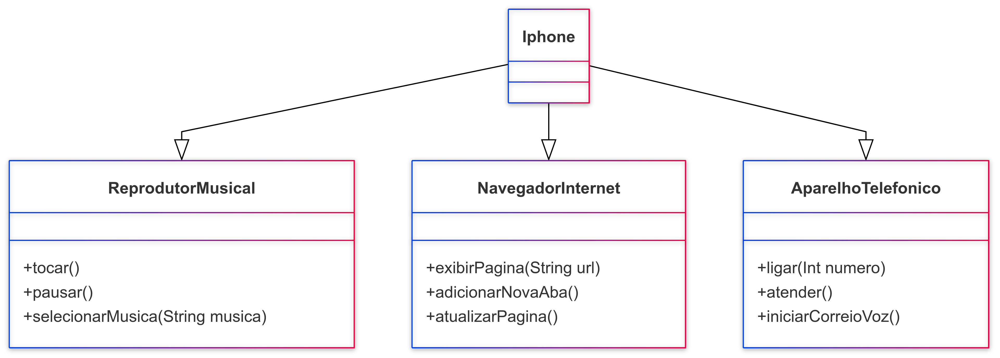

# modelando-iphone-uml
Modelando o Iphone com UML- Praticando POO

Diagrama de classes: 

Iphone --|> ReprodutorMusical 
Iphone --|> NavegadorInternet 
Iphone --|> AparelhoTelefonico 

class ReprodutorMusical{
+tocar()
+pausar()
+selecionarMusica (String musica) 
}
class AparelhoTelefonico {
+ligar(Int numero) 
+atender()
+iniciarCorreioVoz()
}
class NavegadorInternet{
+exibirPagina(String url) 
+adicionarNovaAba() 
+atualizarPagina() 
}

